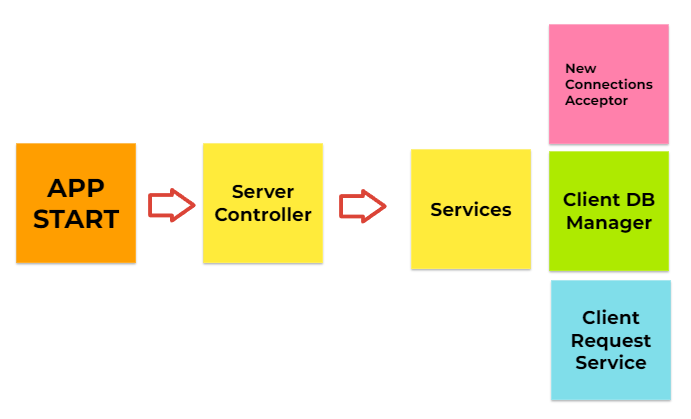

# tcpserver
TCP/IP server using socket programming

## TCP Server Properties

- On starting, server must **listen** on a user configured IP-Address and Port Number
- Server must be available to **accept** new connection requests from new clients
- Server should be able to handle multiple client's connections **simultaneously**. This can be accomplished through multi-threading, multi-processing, or multiplexing.
- Server must handle both **connection** and **disconnection**
- Server must be able to **shut down gracefully**. This includes disconnecting all clients connections, freeing up all resources before terminating the process.
- Server must be optimized to service **maximum clients** and with as much high availability as possible. 
- Server must be **configurable** to abide by certain rules. 1) Accept no more new connections. 2) Stop listening to all or particular clients

## TCP Server Architecture

Services runs as separate threads in infinite loop. The server controller acts as the central entity responsible for managing the service threads and Client DB. It starts all service threads and intializes resources required for the server. When asked to shut-down by the application, the controller will purge client DB and send shut-down notification to all service threads and allow them to release their resources before shutting down. Service threads do not communicate directly but instead through server controller. This allows scalability as services are independent from each other.

### Server Controller

- Invoked by AppIn Thread / Service Threads
- Set of APIs to manage service operations
- Facilitate communication between service threads

### Connection Acceptor Service 

- Responsible for accepting new connection requests from clients. (TCP Handshake)
- A thread

### Client DB Manager

- Responsible for storing all connected clients
- A data structure

### Client Data Request Service

- Responsible for communicating with connected clients
- Maintains one or more copy of all connected clients
- A thread + data structure

## Project Timeline 

### Common

✅ Project Architecture and Class Definitions  

### Server Controller

✅ Receive and Process New Connecting Clients from Connection Acceptor Service to other services  
✅ Receive and Process Disconnecting Clients from Connection Acceptor Service to other services  
✅ Receive and Process Data Requests from Clients to other services  
✅ Upon Shut Down, Terminate All Services and Gracefully Shut Down  

### Connection Acceptor Service 

✅ Accept Connection Request from Clients  

### Client DB Manager

✅ Store Connected Clients   
✅ Add/Remove Clients  

### Client Data Request Service 
 
✅ Receive Data from Clients

### Postphoned until Client Completion

For progress report, visit [client repository](https://github.com/soooooyoung/unity-client-demo)

🕓 Fetch Data Upon Client Request  
🕓 Deliver Data to Clients  

### Postphoned until Database Completion

🕓 Connect to Database (External)  
